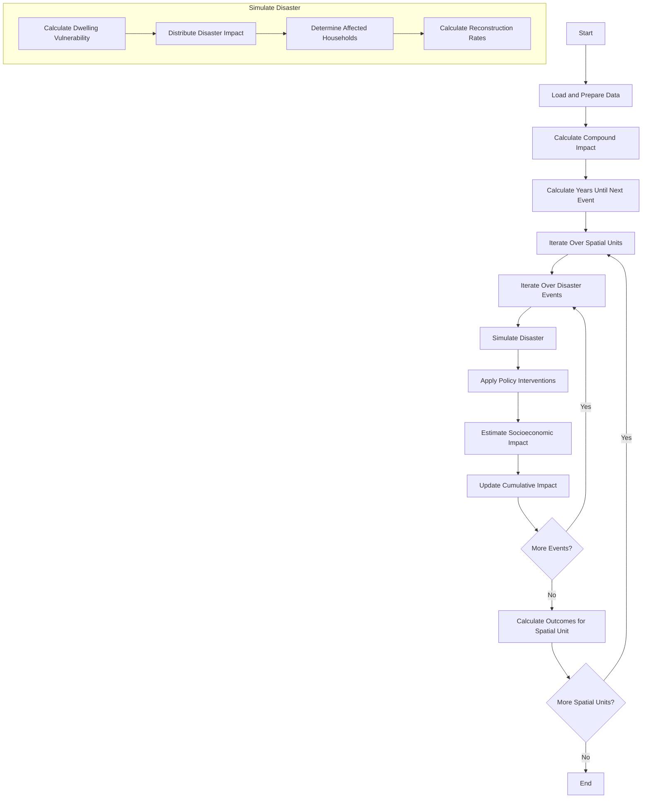

# unbreakable

Unbreakable is a simulation tool that helps estimate how disasters affect households, showing how different social groups recover and how policies can reduce the damage.

## Motivation

Natural disasters are becoming more frequent and intense, with a significant rise in events over recent decades. According to the [UNDRR](https://www.undrr.org/media/48008/download?startDownload=20240603), the number of recorded disasters nearly doubled from 4,212 between 1980-1999 to 7,348 between 2000-2019. In 2023, extreme weather events caused massive economic losses of 280 million USD ([PreventionWeb](https://www.preventionweb.net/news/europe-spotlight-global-economic-losses-catastrophes-reach-usd-280-billion-2023)) and impacted 93.1 million people globally ([EM-DAT](https://civil-protection-knowledge-network.europa.eu/media/2023-disasters-numbers-significant-year-disaster-impact)).

Disasters do not affect all populations equally. Lower-income households are more vulnerable, as they often lack adequate resources for protection and recovery ([Bangalore et al., 2016](http://hdl.handle.net/10986/25335); [Walsh & Hallegatte, 2020](https://link.springer.com/article/10.1007/s41885-019-00047-x)). Vulnerable groups like female-headed households and people with disabilities are also disproportionately impacted.

Beyond economic loss, disasters affect overall well-being, which isn’t fully captured by traditional metrics. To better understand these broader impacts, we need alternative approaches.

Unbreakable is a simulation tool designed to:

1. Estimate disaster impacts on different social groups.
2. Analyze effects across economic, poverty, and well-being dimensions.
3. Explore how policy interventions can reduce these impacts.

## Project Structure

```bash
unbreakable/
├── config/                  # Simulation model run configuration files
├── data/                    # Data directory
│   ├── generated/           # Generated data, e.g., pre-computed reconstruction rates 
│   ├── processed/           # Processed data used as an input into simulation model
│   └── raw/                 # Raw data
├── data_preparation/        # Data preprocessing notebooks
├── docs/                    # Documentation
├── notebooks/               # Analysis notebooks
├── unbreakable/             # Main package
│   ├── analysis/            # Analysis modules
│   ├── experiments/         # Experiment setup and runner
│   ├── modules/             # Core simulation modules
│   └── utils/               # Utility functions mainly for data preparation
├── results/                 # Simulation results
├── tests/                   # Unit tests
├── CONTRIBUTING.md          # Guidelines for contributing to the project
├── README.md                # Project overview and instructions
├── requirements.txt         # List of dependencies
└── setup.py                 # Installation script
```

## Installation

1. Clone the repository:

   ```bash
   git clone https://github.com/mikhailsirenko/unbreakable.git
   cd unbreakable
   ```

2. Create a virtual environment with conda (optional but recommended):

   ```bash
   conda create --name unbreakable
   conda activate unbreakable
   ```

3. Install dependencies:

   ```bash
   pip install -r requirements.txt
   ```

4. Install the package in editable mode:

   ```bash
   pip install -e .
   ```

## Basic Usage

To run a simulation:

```python
python unbreakable/example.py
```

The `example.py` script requires specifying disaster types, their timing (immediate or at a specific year, e.g., year 5), and return periods. By default, `example.py` simulates the immediate impact of a flood with a return period of 100 years.

You also need to specify the number of replications with `n_scenarios`. The model is stochastic, and to obtain robust results, multiple replications are necessary. In each run, the model randomly selects which households are affected and the amount of assets they lose. By default, `n_scenarios = 1,000`.

For a more comprehensive description, please refer to the User Manual or the detailed documentation in the `docs/` directory.

## Data

The model uses three main types of data:

1. Household survey data (`data/processed/household_survey/`),
2. Asset impact data (`data/processed/asset_impact/`), or
3. Population impact data (`data/processed/population_impacts/`)

Household survey data contains information on households' socio-economic attributes and dwelling materials. Asset impact data provides information about potential damage to total assets of a spatial unit (e.g., a district). Population impacts data contains information about the number of individuals affected by a disaster.

The repository contains example data of all types which were generated with `unbreakable/utils/data_generator.py`.

## Configuration

Simulations are configured using YAML files in the `config/` directory. The `Example.yaml` file provides an example configuration. You can modify this file to set up your simulation parameters, including:

- Macro-economic parameters of the case country.
- Disaster-related parameters, including whether households would lose  their income due to disaster.
- Which household characteristics must be estimated and randomized.
- Policy interventions, e.g., adaptive social protection.
- Uncertainties.

## Model Components

The core model components are located in the `unbreakable/modules/` directory:

- `disaster_impact.py`: Simulates disaster impacts on households.
- `dwelling_vulnerability.py`: Calculates dwelling vulnerability based on construction materials.
- `household_recovery.py`: Models household recovery processes over time.
- `policy_interventions.py`: Implements policy interventions such as cash transfers or retrofitting.
- `socioeconomic_impact.py`: Assesses economic, poverty, and well-being impacts.

## How It Works

The Unbreakable Model stored in `model.py` follows a step-by-step process to simulate disaster events and their impacts. The basic idea is that we pass the households' data frame through a set of functions representing different stages of the simulation. The pipeline works as follows:

1. **Data Loading and Preparation**:
   - Load household data, disaster impact data, and reconstruction rates.
   - Prepare the household data, estimate missing attributes (e.g., savings) and randomize them.

2. **Disaster Impact Calculation**:
   - Calculate compound impacts if multiple disaster events are specified.
   - Determine the years until the next event for each disaster.

3. **Spatial Unit Iteration**:
   - The model iterates over each specified spatial unit (e.g., regions, cities).

4. **Disaster Event Simulation**:
   - For each spatial unit, the model simulates multiple disaster events sequentially.
   - Each event's impact is calculated based on either the percentage of population affected or Probable Maximum Loss (PML).

5. **Household Impact Distribution**:
   - The disaster impact is distributed among households based on their vulnerability.
   - Households are classified as affected or unaffected.

6. **Recovery Simulation**:
   - Calculate or use precomputed household reconstruction rates.
   - Estimate the socioeconomic impact on households, including consumption, poverty and well-being losses.

7. **Policy Interventions**:
   - The model allows for the application of policy interventions, such as adaptive social protection or retrofitting policies.

8. **Cumulative Impact Tracking**:
   - The model keeps track of cumulative impacts across multiple events.

9. **Outcome Calculation**:
   - Calculate various metrics for each spatial unit after all events have been simulated.

This pipeline allows for the simulation of multiple disasters over time, assessment of cumulative impacts, and evaluation of policy interventions at various stages.



## Analysis

Analysis modules in `unbreakable/analysis/` include:

- `distributional_metrics.py`: Analyzes impacts across different groups
- `economic_metrics.py`: Calculates economic impact metrics
- `metric_calculator.py`: Analyzes household-level impacts
- `poverty_metrics.py`: Computes poverty-related metrics
- `resilience_metrics.py`: Calculates resilience indicators

Jupyter notebooks for analysis are available in the `notebooks/` directory. These notebooks demonstrate how to interpret the simulation outcomes and visualize results.

## Results

Simulation results are stored in the `results/` directory. The `Example/` subdirectory contains example results.

## Note for Users

This model uses algorithms and data analysis techniques. While it strives for accuracy, real-world scenarios may differ. Use the results only as a guide for decision-making, always complemented by expert knowledge and local context.

## Contributing

We welcome contributions to the Unbreakable project. Please refer to our [`CONTRIBUTING.md`](CONTRIBUTING.md) for information on submitting pull requests, reporting issues, or suggesting improvements.

## License

This project is licensed under Creative Commons Attribution-ShareAlike 4.0 International (CC BY-SA 4.0).

## Citation

1. If you use this tool in your research, please cite it as:

   Sirenko, M. & Jafino, B. A. (2024). Unbreakable: A Simulation Tool for Estimating Socio-Economic Impacts of Disaster on Households. GitHub repository: <https://github.com/mikhailsirenko/unbreakable>

2. The original World Bank report and research paper:

   Bangalore, M., Hallegatte, S., Vogt-Schilb, A., Rozenberg, J. (2017). Unbreakable: Building the Resilience of the Poor in the Face of Natural Disasters. Climate Change and Development. Washington, DC: World Bank. <http://hdl.handle.net/10986/25335>.

   Walsh, B., & Hallegatte, S. (2020). Measuring natural risks in the Philippines: Socioeconomic resilience and wellbeing losses. Economics of Disasters and Climate Change, 4(2), 249-293.

## Contact

For questions or feedback, please contact Mikhail Sirenko at msirenko at worldbank.org.
